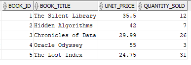
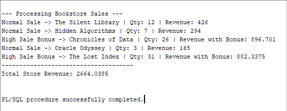

## Names: ISHIMWE Fabrice

## ID: 27111

**Bookstore Sales Tracker**  
A PL/SQL teaching repository demonstrating records, collections (TABLE OF RECORD), and a guarded GOTO example — all built around a simple BOOK_SALES table.

---

## Learning Goals

- Use table-based records (%TYPE / RECORD) and collections.
- Demonstrate iteration over collections.
- See a minimal, safe GOTO demo for handling high-sale books.
- Integration script prints each book’s revenue and total store revenue.

---

## Quick Start

Enable DBMS output in your client:

```sql
SET SERVEROUTPUT ON;


Run the scripts in order:

01_create_tables.sql — creates the BOOK_SALES table and inserts sample books.

02_process_sales.sql — demonstrates RECORD, COLLECTION, and GOTO to calculate revenue and high-sale bonuses.


### Screenshots

**Table creation and data insert**


**PL/SQL output (records + collection + GOTO)**

```
